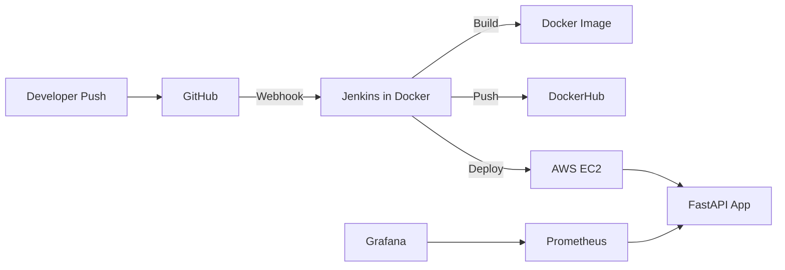

# house-price-devops

## Project Overview

`house-price-devops` is a beginner-friendly DevOps + MLOps project that predicts California house prices with a tiny sklearn model and deploys the app with Docker, Docker Compose, Jenkins, Terraform, AWS EC2, Prometheus, and Grafana.

The goal is to learn the full delivery pipeline:

1. Train a simple model.
2. Package the API in Docker.
3. Trigger Jenkins from a GitHub webhook.
4. Build and push the image to DockerHub.
5. Pull and run the updated container on EC2.
6. Monitor the app with Prometheus and Grafana.

## Architecture Diagram



## Folder Structure

```text
house-price-devops/
├── app/
│   ├── main.py
│   ├── train.py
│   ├── model.pkl
│   ├── requirements.txt
│   ├── prometheus.yml
│   ├── templates/
│   │   └── index.html
│   └── static/
├── Dockerfile
├── docker-compose.yml
├── Jenkinsfile
├── terraform/
│   ├── main.tf
│   ├── variables.tf
│   ├── outputs.tf
│   └── provider.tf
├── README.md
└── .gitignore
```

The Compose setup also includes `grafana/provisioning/datasources/datasource.yml` so Grafana can auto-load Prometheus.

## Complete Workflow

1. Train the model with `app/train.py`.
2. Start the FastAPI app locally or with Docker.
3. Push code to GitHub.
4. GitHub webhook calls Jenkins at `/github-webhook/`.
5. Jenkins builds the Docker image.
6. Jenkins logs in to DockerHub and pushes the image.
7. Jenkins stops the old container and runs the new one.
8. Prometheus scrapes `/metrics`.
9. Grafana reads Prometheus and shows dashboards.

## Tools Used

- Python
- FastAPI
- scikit-learn
- Docker
- Docker Compose
- DockerHub
- GitHub Webhooks
- Jenkins
- Terraform
- AWS EC2
- Prometheus
- Grafana

## Local Setup

### 1. Clone the repository

```bash
git clone <your-repo-url>
cd house-price-devops
```

### 2. Create a virtual environment

```bash
python -m venv .venv
.venv\\Scripts\\activate
```

### 3. Install Python dependencies

```bash
pip install -r app/requirements.txt
```

## Train Model

Run the training script to create `app/model.pkl`:

```bash
python app/train.py
```

The script:

- loads the California housing dataset
- trains a `LinearRegression` model
- saves the trained model as `model.pkl`

## Run FastAPI Locally

```bash
uvicorn app.main:app --reload --host 0.0.0.0 --port 8000
```

Open:

- `http://localhost:8000/`
- `http://localhost:8000/docs`
- `http://localhost:8000/metrics`

## Docker Build Instructions

Build the image from the project root:

```bash
docker build -t house-price-api:latest .
```

Run the container:

```bash
docker run -d -p 8000:8000 --name house-api house-price-api:latest
```

## Docker Compose Usage

The compose file starts:

- `app`
- `jenkins`
- `prometheus`
- `grafana`

Start everything:

```bash
docker compose up -d --build
```

Useful URLs:

- App: `http://localhost:8000`
- Jenkins: `http://localhost:8080`
- Prometheus: `http://localhost:9090`
- Grafana: `http://localhost:3000`

## Terraform Deployment

Terraform provisions:

- an Ubuntu EC2 instance
- a security group for ports `22`, `8000`, `8080`, `9090`, and `3000`
- an instance attached to your existing AWS key pair

### Initialize and apply

```bash
cd terraform
terraform init
terraform plan -var="key_name=my-aws-keypair"
terraform apply -var="key_name=my-aws-keypair"
```

### Output

Terraform prints the EC2 public IP after creation.

## How to Create AWS Key Pair

1. Open the AWS EC2 Console.
2. Go to **Key Pairs**.
3. Choose **Create key pair**.
4. Enter a name such as `my-aws-keypair`.
5. Choose **RSA** and **.pem** format.
6. Download the PEM file once. AWS will not show it again.

Terraform uses the existing key pair name only. It does not create SSH keys.

## How to Use PEM File

Store the downloaded PEM file safely and restrict permissions on your local machine.

Example:

```bash
chmod 400 my-key.pem
```

## How to SSH into EC2

Use the PEM file to connect:

```bash
ssh -i my-key.pem ubuntu@<EC2-PUBLIC-IP>
```

## Install Docker on EC2

The Terraform `user_data` script installs Docker and the Docker Compose plugin automatically on Ubuntu.

If you need to install it manually:

```bash
sudo apt-get update -y
sudo apt-get install -y ca-certificates curl gnupg lsb-release
```

Then follow Docker's official Ubuntu installation steps.

## Run Jenkins

Jenkins is built from a custom Docker image and mounts the host Docker socket:

```yaml
- build:
    context: ./jenkins
    dockerfile: Dockerfile
- /var/run/docker.sock:/var/run/docker.sock
```

This allows Jenkins to control the host Docker daemon without Docker-in-Docker, and it avoids reinstalling Docker on every restart.

### Jenkins initial unlock

Open `http://<jenkins-public-ip>:8080` and use the initial admin password from the Jenkins container logs or from `/var/jenkins_home/secrets/initialAdminPassword`.

If Jenkins is starting for the first time, wait a couple of minutes after `docker compose up -d` before opening the page.

### DockerHub credentials

Create Jenkins credentials:

- Kind: **Username with password**
- ID: `dockerhub-credentials`
- Username: your DockerHub username
- Password: your DockerHub access token or password

## Configure DockerHub Credentials

In Jenkins, add the DockerHub secret to **Manage Jenkins > Credentials** so the pipeline can log in securely.

The pipeline uses:

```groovy
withCredentials([usernamePassword(credentialsId: 'dockerhub-credentials', ...)])
```

## Configure GitHub Webhook

Use this webhook URL:

```text
http://<jenkins-public-ip>:8080/github-webhook/
```

In GitHub:

1. Open the repository settings.
2. Go to **Webhooks**.
3. Add a webhook.
4. Paste the Jenkins webhook URL.
5. Choose `application/json`.
6. Select **Just the push event**.
7. Save the webhook.

In Jenkins, make sure the job is configured to trigger builds from GitHub webhooks.

## CI/CD Workflow

1. Developer pushes code to GitHub.
2. GitHub webhook notifies Jenkins.
3. Jenkins checks out the latest commit.
4. Jenkins builds the Docker image.
5. Jenkins authenticates to DockerHub.
6. Jenkins pushes the image to DockerHub.
7. Jenkins stops the old container.
8. Jenkins pulls the latest image.
9. Jenkins runs the updated container.

## Prometheus Setup

The app exposes metrics on:

```text
/metrics
```

Prometheus scrapes:

```text
app:8000
```

The scrape interval is `5s` in `app/prometheus.yml`.

Open Prometheus:

```text
http://localhost:9090
```

## Grafana Setup

Grafana runs on:

```text
http://localhost:3000
```

Default credentials from Compose:

- Username: `admin`
- Password: `admin`

After login:

1. Add Prometheus as a data source.
2. Use the Prometheus URL inside the compose network: `http://prometheus:9090`.
3. Create a dashboard.
4. Add panels for request count, latency, and status codes.

## Monitoring Dashboards

Useful metrics to visualize:

- request count
- response latency
- request rate
- status code distribution

## Common Errors

### `model.pkl was not found`

Run:

```bash
python app/train.py
```

### DockerHub login fails

- Check the Jenkins credential ID.
- Use a DockerHub access token if your account requires it.

### Jenkins cannot run Docker commands

- Confirm `/var/run/docker.sock` is mounted.
- Confirm the Jenkins container has Docker CLI available.

### Prometheus shows no data

- Confirm the app is running.
- Confirm the target is `app:8000`.
- Check the `/metrics` endpoint in the app.

## Troubleshooting

- Check container logs with `docker logs <container-name>`.
- Check Jenkins pipeline console output.
- Confirm EC2 security group inbound rules.
- Verify the PEM file path and permissions.
- Ensure the Docker image tag matches the DockerHub repository name.

## Future Improvements

- Add a proper model retraining pipeline.
- Add automated tests.
- Add model versioning.
- Add alerting in Prometheus.
- Add a custom Grafana dashboard JSON export.
- Add a production reverse proxy such as Nginx.
